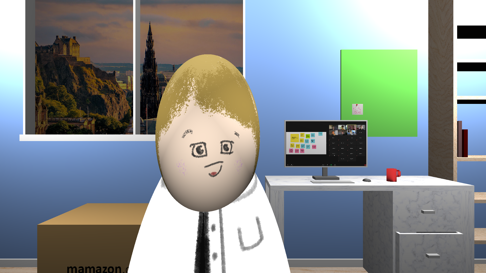
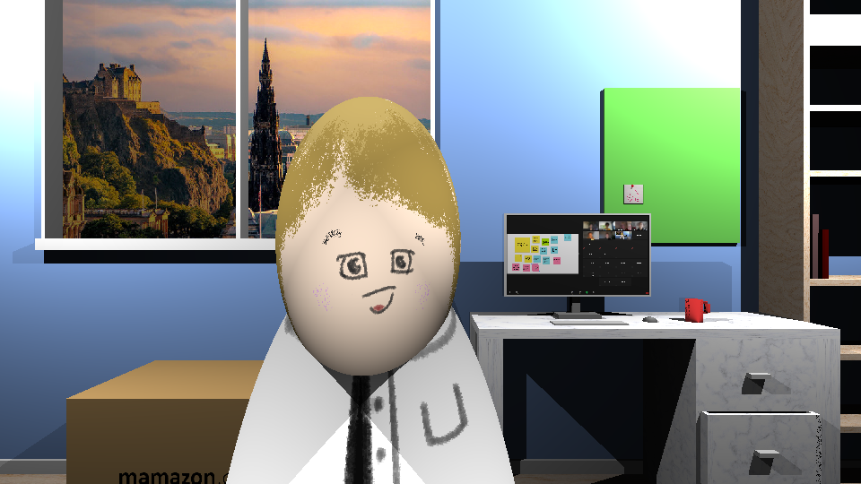

# SimpleRayTracerHS

This is a ray tracer built in Haskell, for the Functional Programming competition at University of Edinburgh. As it is my first attempt at a proper ray tracer, it is full of unoptimized calculations. However, the output looks pretty good.

The script generates a sequence of PNG images (to be combined for GIF) of a ray-traced world. It supports shadows, although it is computationally expensive at an exponential cost. The script can utilize all the CPUs available through concurrent threading.

`RayTracer.hs` contains the core RayTracing functionality, `Vector.hs` contains the vector module, and `Main.hs` contains the world configuration, as well as the code for concurrency.

## Running

Compile using GHC:
```
ghc -O2 -fexcess-precision -optc-ffast-math -optc-O3 -threaded -rtsopts Main.hs
```
The options enable faster floating point math, more optimization, multi-thread compatibility, and a profiler (which you can show by adding the `+RTS -s` flag to the executable).

Make sure to utilize available cores by using `+RTS -N<number>`, such as `+RTS -N64`.

### Requirements:
- `Main` has to be executable (chmod +x Main).
- There has to be a folder named `output`.

### Command-line arguments:

```
--shadow        Turns on the shadow if specified.
--noshadow-zoom If specified uses the no-shadow texture on Zoom. 
                Useful for the generating the first render to put into the texture.
--frames        If specified only renderes those frames. Separated by comma.
                Ex: --frames 0,2,5
--res 192:108   Specifies the output resolution. If unspecified uses 960:540.
```

### Conversion to GIF/MP4

Using `ffmpeg` this is as trivial as running:
- `ffmpeg -i %03d.png output.gif` for GIF, or
- `ffmpeg -i %03d.png -pix_fmt yuv420p output.mp4` for mp4.

## Libraries

- JuicyPixels (for generating images)
- Async (for concurrency)

## Generated Images:

- `./Main --frames 0 --res 1920:1080 +RTS -s` (~5 minutes on DICE)


- `./Main --frames 0 --res 960:540 --shadow +RTS -s -N64` (~173 minutes on DICE)



- `./Main --res 1280:720 +RTS -s -N5` (~94 minutes)
- `ffmpeg -i %03d.png output.gif`


## Credits

All textures are either hand-drawn (by me), stock images, or screenshots with faces blurred and names changed.